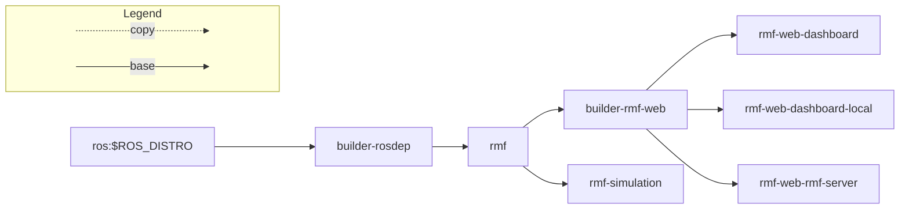

Structure: https://github.com/open-rmf/rmf_deployment_template#docker-images-structure
## Docker images structure


TODO:
Design a hierarchy of Dockers Images
* ros2:[humble|rolling]	
  * Source based
    * rmf source dependencies (rosdep executed in rmf)
    * rmf installed from sources
  * Binary based
    * rmf core 
    * rmf simulation
    * rmf demos
    * rmf web
* almalinux:latest
* ubi8 

## Building images
You can look into the github workflow to get an idea of how to build images:
[Github Workflow](https://github.com/open-rmf/rmf_deployment_template/blob/main/.github/workflows/docker-image.yml).

From the root directory of this repo, you can run the following commands to build the images:
```
# Install and run vcs import rmf
curl -sSL https://raw.githubusercontent.com/ros/rosdistro/master/ros.key  -o /usr/share/keyrings/ros-archive-keyring.gpg
echo "deb [arch=$(dpkg --print-architecture) signed-by=/usr/share/keyrings/ros-archive-keyring.gpg] http://packages.ros.org/ros2/ubuntu $(lsb_release -cs) main" | \
sudo tee /etc/apt/sources.list.d/ros2.list > /dev/null
sudo apt update
sudo apt install python3-vcstool -y
mkdir rmf-src
vcs import rmf-src < rmf/rmf.repos
```
```
ROS_DISTRO="${ROS_DISTRO:-humble}"
docker build -f rmf/builder-rosdep.Dockerfile -t open-rmf/rmf_deployment_template/builder-rosdep .
docker build -f rmf/rmf.Dockerfile -t open-rmf/rmf_deployment_template/rmf .
```